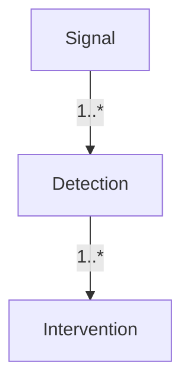

# OpenInspector Documentation

Welcome to the **OpenInspector** developer documentation.  
This section supplements the top-level `README.md` with additional technical
material, architectural diagrams, and API references.

## Table of contents

1. Quick-start guide
2. Architectural overview
3. Configuration reference
4. Database schema
5. Developer workflow
6. Changelog

---

## 1. Quick-start guide

1. Install the package from source:

```bash
git clone https://github.com/llamasearchai/OpenInspector.git
cd openinspector
pip install -e '.[dev]'
```

2. Export your OpenAI key and start the server:

```bash
export OPENAI_API_KEY=sk-your-key
openinspector
```

3. Send a test signal (using `httpx` or cURL):

```bash
curl -X POST http://localhost:8000/signals \
  -H 'Content-Type: application/json' \
  -d '{"type": "authentication", "user_id": "demo", "success": false}'
```

## 2. Architectural overview


The service consists of:

* **FastAPI layer** – HTTP ingestion & analytics endpoints.
* **Detection engine** – rule-driven risk analysis.
* **Defense system** – maps detections to interventions.
* **SQLite (async)** – durable storage for signals/detections/interventions.
* **Prometheus metrics** – exported via `/metrics`.
* **OpenAI agent** – optional LLM reasoning pipeline.

## 3. Configuration reference

All settings are read from environment variables (or `.env`). See `openinspector/config.py` for authoritative schema.

| Variable | Default | Purpose |
|----------|---------|---------|
| `API_HOST` | `0.0.0.0` | Bind address |
| `API_PORT` | `8000` | Port to listen on |
| `DATABASE_URL` | `sqlite+aiosqlite:///openinspector.db` | SQLAlchemy database URL |
| `OPENAI_API_KEY` | _empty_ | Required for agent features |
| `OPENAI_MODEL` | `gpt-4o-mini` | Chat completion model |

## 4. Database schema

See `openinspector/models.py` for declarative mapping. Three main tables are created:

* `signals`
* `detections`
* `interventions`

Entity-relationship diagram:



## 5. Developer workflow

1. Format & lint:

```bash
ruff check .
black .
```

2. Run test-suite:

```bash
pytest -q
```

3. Build & publish:

```bash
python -m build
twine upload dist/*
```

## 6. Changelog

See `../CHANGELOG.md`. 